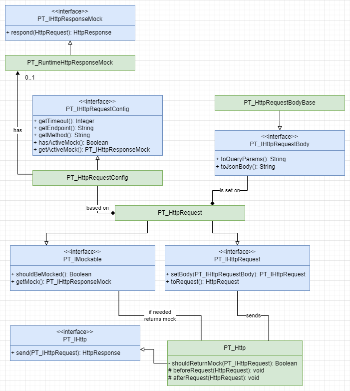

# What is it?

It's a minimalistic framework that's meant to centralize performing http requests,
provide an easy-to-understand API, and at the same time do not limit the developer
flexibility which may be needed to handle more complex scenarios.

## Key characteristics

- Metadata based request configuration
- Strong focus on readability, testability and extensibility
- Self-contained (no dependencies on any other tool)
- Ability to mock responses at runtime
- Fully unit tested

## General flow (Simplified)

1. For each *http request* you create a record of a **PT_HttpRequest__mdt** metadata
   storing information about endpoint, http method and timeout.
2. You create a class extending **PT_HttpRequestBodyBase** (or implementing **PT_IHttpRequestBody**)
   which contains the fields required by the endpoint.
3. You create an instance of a **PT_HttpRequest** using the *DeveloperName* of your
   metadata record created in point 1. and set its body to the **PT_IHttpRequestBody** instance created
   in point 2.
4. You use **PT_Http** to send that *request* and receive *HttpResponse*.

## Installation 

Bellow you can find one of many ways to bring the framework files to your org.

```bash
#clone the repository
git clone git@github.com:x1r15/PT_HttpRequestFramework.git 
#log into the org where you want to deploy the changes to
sf org login web --instance-url [instanceUrl] --alias [alias] 
#deploy content of force-app folder to that org
sf deploy start --source-dir force-app/ -o [alias]
```

In case you are already working in the environment, and your IDE has been set up, you can simply clone the
repository (first command above) and then drag the **force-app** folder onto the **force-app** folder in your project.

# Key elements

## Class Diagram

Class diagram containing all major actors. Some methods, especially private ones and all 
the fields/properties are omitted for brevity. Details regarding the most important classes 
and interfaces can be found below.



## PT_HttpRequestBodyBase

[Visit](force-app/main/default/classes/HttpRequest/PT_HttpRequestBodyBase.cls) | A simple
*abstract* class capable of serializing itself (and derivatives) to **Json** and **Query
Params** format. Classes that derive from it should contain fields required by the endpoint.

### Usage

[Example](force-app/main/default/classes/HttpRequest/Example/ExampleRequestBody.cls) | In this
example class we simply extend the **PT_HttpRequestBodyBase** and add required fields as specified
in the API documentation.

```Apex
// based on https://www.alphavantage.co/documentation/, see Example folder
public class ExampleRequestBody extends PT_HttpRequestBodyBase {
    public String function;
    public String symbol;
    public String interval;
    public String apikey;
}
```

As a part of the logic in **PT_HttpRequest** the body will be converted to either **query params**
or **json** body depending on the request method. For that base class methods `String toQueryParams()`
and `String toJsonBody()` will be used.

### PT_IHttpRequestBody

The **PT_HttpRequestBodyBase** class implements interface of type **PT_IHttpRequestBody** declaring both
of the methods: `String toQueryParams()` and `String toJsonBody()`. In case you have a specific use case
which requires more complex serialization logic you can simply create your own class implementing the
interface and implement your own serialization logic.

Example of inner class used to test **PT_HttpRequest** which implements its own "serialization" logic.
To check the class in context [click here](force-app/main/default/classes/HttpRequest/Test/PT_HttpRequestTest.cls).

```Apex
// [...] Omitted for brevity
private static final String BodyMock_Query = '?a=b';
private static final String BodyMock_Json = '{"a":"b"}';
// [...] Omitted for brevity
private class PT_TestRequestBody implements PT_IHttpRequestBody {
    public String toQueryParams() {
        return BodyMock_Query;
    }

    public String toJsonBody() {
        return BodyMock_Json;
    }
}
```

## PT_HttpRequest

[Visit](force-app/main/default/classes/HttpRequest/PT_HttpRequest.cls) | It's a class responsible for generating
*HttpRequest* based on the **PT_HttpRequest__mdt** metadata record. It handles conversion of the request body to
either **query params** or **json** (based on the HttpMethod). Also, as the class implements the **PT_IMockable**
interface it is capable of returning mocked response (More about that in [runtime mocks](#runtime-mocking) section).

### Usage

```Apex
// [...] Omitted for brevity

// SomeBody implements PT_IHttpRequestBody
SomeBody body = new SomeBody('a', 'b', 'c');

PT_IHttpRequest req =
        new PT_HttpRequest('MetadataRecordDevName')
                .setBody(body);

// --- or preferably (check tip below)

PT_IHttpRequest req =
        new PT_HttpRequest(
                ReqTypes.MetadataRecordDevName.name())
                .setBody(body);

HttpResponse responseBody = new PT_Http().send(req);
```

1. As part of the business logic instance of **PT_IHttpRequestBody** is created. In the example above it is
   the **SomeBody**.
2. **PT_HttpRequest** instance is created and the identifier of a related metadata record is being
   passed to the constructor (value in **PT_Identifier__c** field).
3. The *body* is set on the *request* via the `PT_IHttpRequest setBody(PT_IHttpRequestBody body)` method.
4. The *request* is passed to `HttpResponse send(PT_IHttpRequest request)` method of the **PT_Http** class
   discussed below.

> **Tip:** *PT_HttpRequest* requires you to pass the identifier of the related metadata record. In the example above
> we have seen two ways of doing that. Second way, using *enum* is encouraged.
>
> An *enum* containing identifiers of the metadata records can be created (or even better generated).
> Example:
>
> ```Apex
> public enum HttpRequestTypes {
>     MyFirstRequest,
>     MySecondRequest,
>     MyThirdRequest
> }
> ```
>
> Then the value can be easily converted to String:
> ```Apex
> String identifier = HttpRequestTypes.MyFirstRequest.name();
> ```
>
> This will allow you to avoid magic strings in your code.
> 
> Alternatively, if that seems overkill, you can always use constant stored within a relevant business class
> ```Apex
> public static final String Identifier = 'MyFirstRequest';
> ```

## PT_Http

[Visit](force-app/main/default/classes/HttpRequest/PT_Http.cls) | Wrapper around native **Http** class meant
to provide central place for all requests and responses to come through. That's a class that ultimately decides
if the mocked response should be returned. If active mock is associated with the request, it *will not be sent*,
instead a mocked version of HttpResponse will be returned. For more information check [runtime mocks](#runtime-mocking) 
section.

### Usage

```Apex
// [...] creation of PT_IHttpRequest
PT_IHttp http = new PT_Http();
HttpResponse response = http.send(ptRequest); // where ptRequest is PT_IHttpRequest
// [...] processing of the HttpResponse
```

### Extending

The class contains two protected virtual methods  
`void beforeRequest(HttpRequest request)`  
`void afterRequest(HttpRequest request, HttpResponse response)`  
which can be used to add logic which should be happening before orafter all requests
e.g. *logging*.

> **Tip:** avoid modifying the framework classes as it may prevent you from upgrading them
> to new versions. Aim to extend the classes you want to build upon or if you need even more
> flexibility use one of the provided interfaces e.g. `PT_IHttp`, however bear in mind this will
> result in loss of existing class capabilities.


## PT_HttpRequestConfig

[Visit](force-app/main/default/classes/HttpRequest/PT_HttpRequestConfig.cls) | A class
responsible for providing the metadata records to **PT_HttpRequest** based on the
provided developer name. It not only separates the data fetching operation but also
facilitates writing configuration independent *unit tests*.

To remain self-contained the framework's *unit tests* which required injecting metadata
have been written using
[native Stub API](https://developer.salesforce.com/docs/atlas.en-us.apexcode.meta/apexcode/apex_testing_stub_api.htm).
However, there is nothing wrong in doing that using other tools such as e.g. *UniversalMocker*
or *FFLib Apex Mocks*. To see the *Stub API* based implementation check
[PT_HttpRequestConfigMock](force-app/main/default/classes/HttpRequest/Test/PT_HttpRequestConfigMock.cls) and
[PT_HttpRequestTest](force-app/main/default/classes/HttpRequest/Test/PT_HttpRequestTest.cls).

## PT_HttpRequest__mdt

It's a very basic *Custom Metadata Type* which contains the definition of a request. This includes:

- Named Credentials (String, 255) - Named Credentials name, with **no** "callout:" prefix.
- Endpoint (String, 255); - an endpoint starting with "/"
- Method (Picklist); - one of the predefined HTTP methods
- Timeout (Integer, 6, 0); - value between 1 - 120000 
- Active Mock (Lookup, **PT_HttpResponseMock__mdt**)
- Use In Production (Checkbox) - distinguishes sandbox records from production ones
- Description (String, 255) - can be used to provide short description/comment
- Identifier (String, 255) - **PT_HttpRequestConfig** is fetching the records by this field. Both 
sandbox and production records should have *the same value* 

When **PT_ActiveMock__c** field is filled and you are using **PT_Http** the request will not be
sent and instead mocked values from the connected **PT_HttpResponseMock__mdt** record will be
returned. See more about it in the [runtime mocking](#runtime-mocking) section.

# Runtime Mocking
The functionality has been added as Salesforce does not natively support runtime http response 
mocking. Lack of the feature makes it hard to:
- Test specific system functionality in complete isolation from external services.
- Simulate different types of responses.
- Provide the SF side ready solution when third party service is not yet ready.

## How to
1. Create a record of custom metadata type **PT_HttpResponseMock__mdt**. Please notice that if
    needed, you can create some generic responses like Status Code: 200 and an empty body.
2. Go to the callout configuration record (**PT_HttpRequest__mdt**) and connect the mock via the
   **PT_ActiveMock__c** field.  

From that point, the request will be returning mocked response. If you want it to start performing
the actual request, simply empty the **PT_ActiveMock__c** field.

## PT_HttpResponseMock__mdt
Simple metadata used to configure the response returned. It contains two relevant fields:
- Status Code (Integer, 3, 0) - used to set the Status Code of the HttpResponse
- Body (Long Text, 32768) - used to set the Body of the HttpResponse
- Description (String, 255) - can be used to provide some extra information 

The *Developer Name* is not relevant from the framework's code base point of view as the record 
is retrieved based on the relationship field (**PT_ActiveMock__c**) on the **PT_HttpRequest__mdt**
record.

## PT_IMockable
The **PT_HttpRequestBase** class implements the **PT_IMockable** interface which allows it
to provide mock (**PT_IHttpResponseMock**) instance. Please bear in mind that in case you have 
implemented your own **PT_IHttpRequest** you will also have to implement *this* interface in order
to receive mocks. The **PT_Http** class is able to work with any instance of **PT_IMockable**. So 
you will not need a custom implementation of **PT_IHttp**.

## PT_IHttpResponseMock
It's a runtime equivalent of the native *HttpCalloutMock* interface. It's implemented by 
**PT_RuntimeHttpResponseMock** which provides the runtime mock based on the **PT_HttpResponseMock__mdt**
record connected with **PT_HttpRequest__mdt** via **PT_ActiveMock__c** field.

## Example use cases
- You are developing code that depends on a very specific circumstances which are very hard to
simulate or the result (most often error) of the request is non-deterministic. 
- Requests to the API are paid, and you want to avoid making unnecessary callouts.
- The API you are trying to call is temporarily unavailable or not yet developed.
- The response time is significant and affects testing.


## Other important information
- As the request is performed within **PT_Http** class this is where mocked response is returned.
If you decide to go with custom implementation of **PT_IHttp** logic, you will not be able to benefit
from the runtime mocking unless you implement this logic yourself. 
- To facilitate testability, it has been decided that the metadata based mock *will not be returned* 
in unit tests. Doing so would create a test dependency on metadata records, thus whenever you write
tests, you will have to mock the response using native *HttpCalloutMock*.

# Framework Usage Example

For a complete example based on the https://www.alphavantage.co/documentation/ please check the
`force-app/main/default/classes/HttpRequest/Example/` folder and related *custom metadata* record
located in `force-app/main/default/customMetadata/`.


