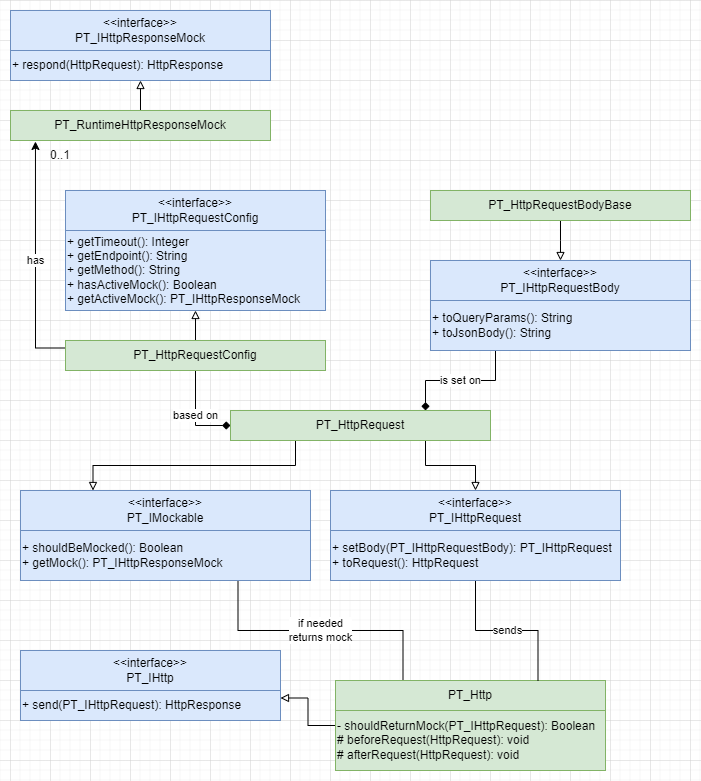

# Key Components

## Class Diagram

The class diagram contains all the major actors. A lot of details were omitted for brevity.



## Classes

### PT_HttpRequestBodyBase

A simple *abstract* class capable of serializing itself (and derivatives) to **Json** and **Query Params** format.
Classes that derive from it should contain fields required by the endpoint. It's used to set the body of the actual
request on the instance of **PT_HttpRequest**.

#### Methods

`public String toQueryParams()` - converts the instance to a query params string such as `?fieldA=ValueA&fieldB=ValueB`.

`public String toJsonBody()` - serializes the instance to a json format.

#### PT_IHttpRequestBody

It's a simple interface containing two methods: `String toQueryParams()` and `String toJsonBody()`. There might be rare
use cases when custom, more complex serialization logic, than this offered by **PT_HttpRequestBodyBase**, will be
required. In those situations, implementing the interface gives the developer full flexibility.

##### When it may be worth using it?

- Depending on different circumstances, you want to skip certain properties.
- Names of some of the JSON fields required by the endpoint are reserved keywords in Salesforce context, and as such,
  you want to implement name conversion (e.g. the word Case).

### PT_HttpRequest

This class generates actual _HttpRequest_ based on the **PT_HttpRequest__mdt** record and the body data provided using
the `PT_IHttpRequest setBody(PT_IHttpRequestBody body)` method. As part of its logic, the body is converted to either *
*query params** or **json** (based on the HttpMethod). Also, as the class implements the **PT_IMockable** interface, it
is capable of returning mocked response (More about that in [runtime mocking](RuntimeMocking.md) section).

#### Constructors

`public PT_HttpRequest(String metadataIdentifier)` - creates an instance of the class associated with a *
*PT_HttpRequest__mdt** record which is later used to generate the **HttpRequest**.

#### Methods

`public PT_IHttpRequest setBody(PT_IHttpRequestBody body)` _from PT_IHttpRequest_ - sets the request body to a provided
value

`public HttpRequest toRequest()` _from PT_IHttpRequest_ - converts the instance to the native **HttpRequest** instance
with body either serialized as **JSON** or as **Query Params** depending on the request's _http method_.

`public Boolean shouldBeMocked()` _from PT_IMockable_ - returns _TRUE_ if the mock is associated with underlying request
custom metadata.

`public PT_IHttpResponseMock getMock()` _from PT_IMockable_ - returns the mock connected with the underlying request
custom record.

#### Usage

```Apex
SomeBody body = new SomeBody('a', 'b', 'c');

PT_IHttpRequest req =
        new PT_HttpRequest('MetadataRecordDevName')
                .setBody(body);

HttpResponse responseBody = new PT_Http().send(req);
```

1. As a part of the business logic, an instance of a class implementing **PT_IHttpRequestBody** interface (or extending
   **PT_HttpRequestBodyBase**) is created.
2. **PT_HttpRequest** instance is created and the identifier of a related metadata record is being passed to the
   constructor (value in **PT_Identifier__c** field).
3. The *body* is set on the *request* via the `PT_IHttpRequest setBody(PT_IHttpRequestBody body)` method.
4. The *request* is passed to `HttpResponse send(PT_IHttpRequest request)` method of the **PT_Http** class
   discussed below.

### PT_Http

A wrapper around the native **Http** class meant to centralize all requests and responses. Part of its logic processes
the provided requests and depending on its setup and either performs the actual **HttpRequest** or simply returns the
runtime mock. More about runtime mocking can be found in the [Runtime Mocking](RuntimeMocking.md) section.

#### Methods

`public HttpResponse send(PT_IHttpRequest request)` - depending on the request configuration either performs the actual
**HttpRequest** and returns actual **HttpResponse** or simply returns the mocked **HttpResponse**.

`void beforeRequest(HttpRequest request)` - empty, virtual method that can be implemented by derived classes to perform
any actions directly before the request has been sent. The method is called within the _send_ method and has access the
actual **HttpRequest**.

`void afterRequest(HttpRequest request, HttpResponse response)` - empty, virtual method that can be implemented by
derived classes to perform any actions directly after the request has been sent and response has been received. It is
called within the _send_ method and has access to the actual **HttpRequest** and either actual or mocked **HttpResponse
**, depending on the request configuration.

#### Usage

```Apex
// [...] creation of PT_IHttpRequest
PT_IHttp http = new PT_Http();
HttpResponse response = http.send(ptRequest); // where ptRequest is PT_IHttpRequest
// [...] processing of the HttpResponse
```

#### Extending

It comes with two convenience methods:

`void beforeRequest(HttpRequest request)`  
`void afterRequest(HttpRequest request, HttpResponse response)`

which can be used in deriving classes to perform custom actions before or/and after each request, such as creating logs
or transforming request/response.

### PT_HttpRequestConfig

A class responsible for providing the metadata records to **PT_HttpRequest** based on the provided identifier. It
facilitates writing configuration independent **unit tests** through abstracting the metadata fetching records.

The
native [Stub API](https://developer.salesforce.com/docs/atlas.en-us.apexcode.meta/apexcode/apex_testing_stub_api.htm)
has been used to write metadata dependent Unit Tests. This allowed the framework to stay self-contained, however for the
business logic you can safely use another mocking solution e.g. *UniversalMocker* or *FFLib Apex Mocks*.

To see the *Stub API* based implementation check
[PT_HttpRequestConfigMock](../../force-app/main/default/classes/HttpRequest/Test/PT_HttpRequestConfigMock.cls) and
[PT_HttpRequestTest](../../force-app/main/default/classes/HttpRequest/Test/PT_HttpRequestTest.cls).

#### Constructors

`public PT_HttpRequestConfig(String metadataIdentifier)` - creates an instance associated with **PT_HttpRequest__mdt**
custom metadata record where **PT_Identifier__c** is equal to provided _metadataIdentifier_. Depending on the
environment (sandbox or production) different record is fetched. If no relevant record has been found, a *
*PT_HttpRequestConfigException** will be thrown.

#### Methods

`public PT_IHttpResponseMock getActiveMock()` - returns a response mock based on the connected **PT_HttpResponseMock__mdt** record. If no record has been connected to the source **PT_HttpRequest__mdt** records a **PT_HttpRequestConfigException** will be thrown. 

`public Boolean hasActiveMock()` - can be used to determine if the source **PT_HttpRequest__mdt** record has mock associated with it. **IMPORTANT:** In Unit Tests the method returns always _FALSE_ to prevent the tests from being dependent on metadata. You can utilize the native **HttpCalloutMock** to receive a response within the testing context. 

`public Integer getTimeout()` - returns the timeout from metadata record, if it hasn't been set a default value of 10s is returned.

`public String getEndpoint()` - returns a complete endpoint containing information about _Named Credentials_ and the actual endpoint.

`public String getMethod()` - simply returns the HttpMethod set on the metadata record.

## Custom Metadata Types

### PT_HttpRequest__mdt

A *Custom Metadata Type* containing the request definition. This includes:

- Named Credentials (String, 255) - Named Credentials name, **without** the "callout:" prefix.
- Endpoint (String, 255); - an endpoint starting with "/"
- Method (Picklist); - one of the predefined HTTP methods
- Timeout (Integer, 6, 0); - value between 1 - 120000
- Active Mock (Lookup, **PT_HttpResponseMock__mdt**)
- Use In Production (Checkbox) - distinguishes sandbox records from production ones
- Description (String, 255) - can be used to provide short description/comment
- Identifier (String, 255) - The **PT_HttpRequestConfig** class is fetching request config records using this field.
  Both sandbox and production records should have *the same value*.

When **PT_ActiveMock__c** field is filled, and you are using **PT_Http** the request will not be sent and instead mocked
values from the connected **PT_HttpResponseMock__mdt** record will be returned. See more about it in
the [Runtime Mocking](RuntimeMocking.md) section.
